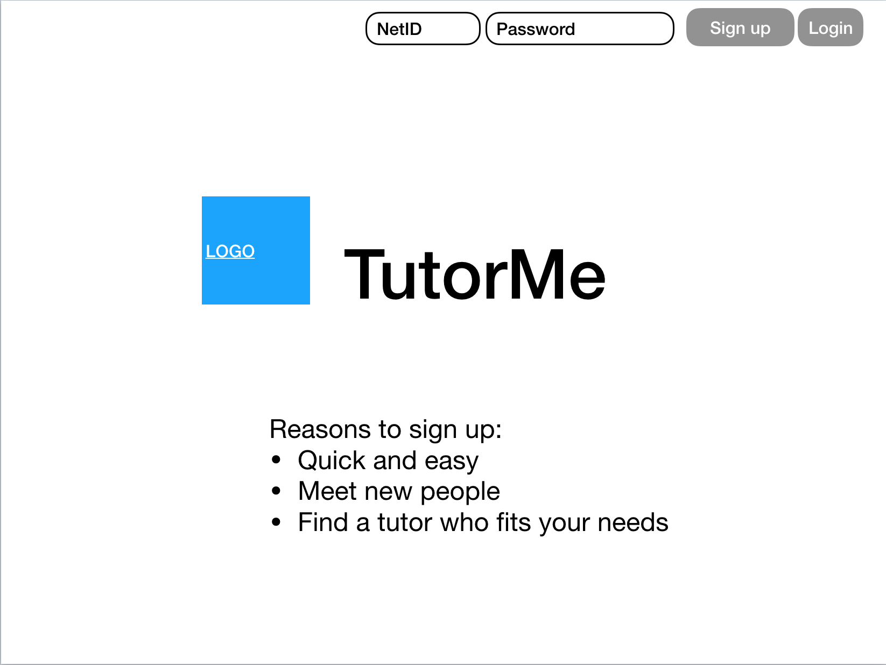
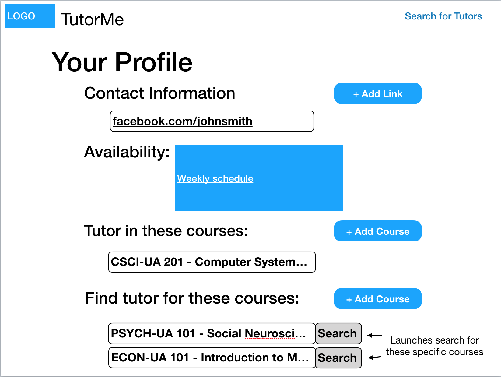
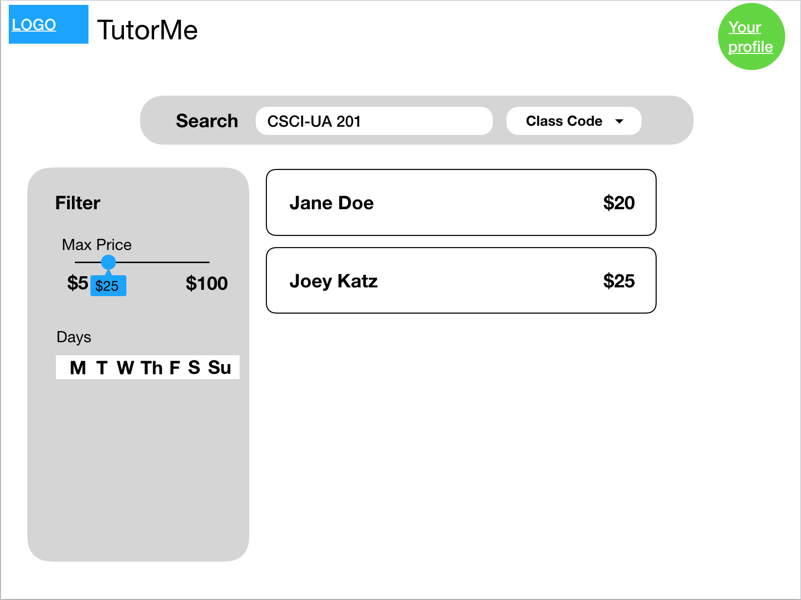
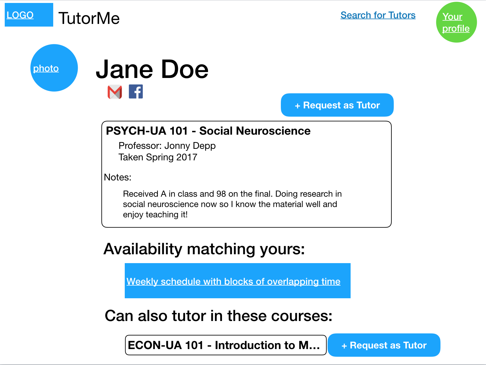
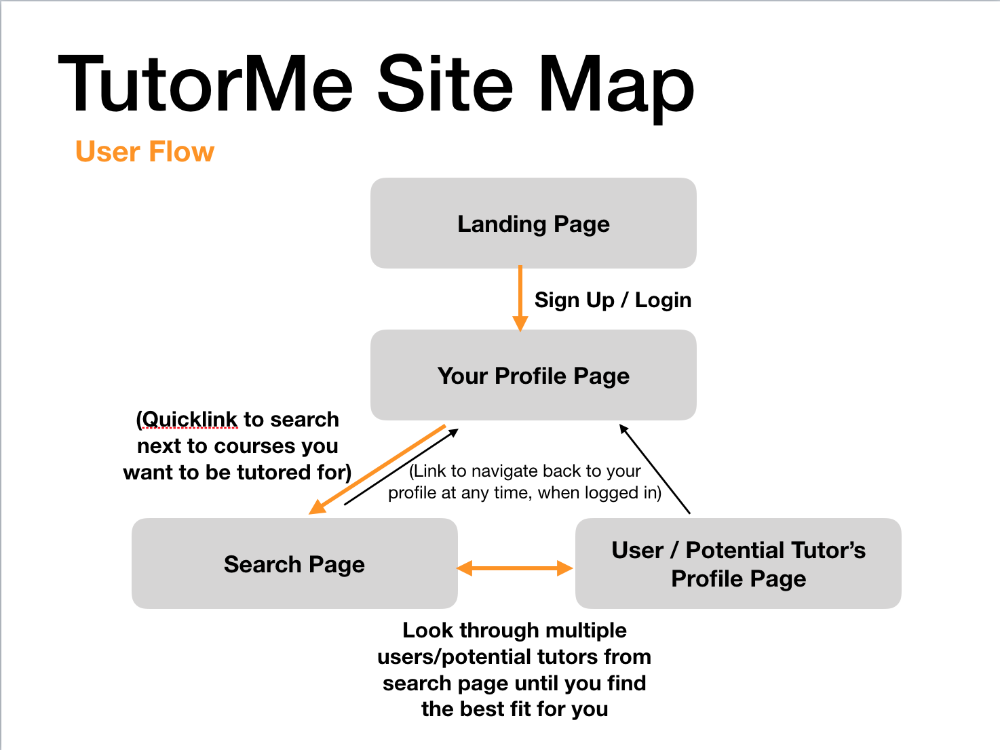

# TutorMe

### Link: [TutorMe App - Alpha](https://tutorme-ait.herokuapp.com/)

## For Testers

**Login with**...<br>
**NetID**: "admin"<br>
**Password**: "testtest"

Feel free to mess around by [on *Sign up* page] creating a new user and [on *Log in* page] logging in.

Once logged in, [on *My Profile* page] adding a biography on who you are, adding course to tutor in, adding a course you would like tutoring for and also [on *Search* page] searching a class by a specific "NYU" course code (eg "csciua201")

## Overview

Struggling in a course and office hours don't fit into your schedule? Don't want to send out an email to the whole CS department in order to find a tutor?

As an acclaimed, global university, one of the richest resources NYU has available is its intellectually-diverse student body. Get connected with another student who has taken the course and knows how to do well in it.

TutorMe is an NYU tutor matching system where registered students can search for tutors by course code. Tutees can then reach out to tutors via email.

## Research Topics

* React
	* React is a client-side JavaScript library that allows developers to create can change over time without reloading the page. React was used to change the app in real time, e.g. as the user add/edit their profile. It was also used to create custom components.
* Passport JS
	* Passport js is an authentication middleware for Node JS. Used in this application for Sign Up and Login validation and authentication. Note: The user's session ends when the user clicks "Log out".
* Axios
	* Used to make http requests from front end to api to retrieve data for all front-end displaying.
* Material UI
	* React component library that implements Google's Material UI design.

## Data Model

The application will store:

**Users**, who can be tutor and tutee (not of the same class)

* Stores user's information
* List of classes willing to tutor in (visible on profile page)
  * Reference to TutorRequest documents
* List of classes looking to be tutored in (not visible on profile page)
  * Array of courseCodes

**Course**, contains information about an NYU course

* A list of available tutors for searching purposes
  * Reference to TutorRequest documents

**TutorRequest**, to be displayed for tutees to search through

* Stores the tutor's net id
* Information that helps tutee make informed decision when choosing a tutor
	* Professor of course taken
	* Price per hour of tutoring
	* Notes (e.g. Got an A, have good understanding of <topics>, willing to share study guides for <chapters>, ...)

User:

```javascript
{
  firstName: "John",
  lastName: "Smith",
  netid: "js123",
  password: // hashed with bcrypt
  shortBio: "4th year grad student in Computer Science...",
  coursesAsTutor: // array of references to TutorRequest documents,
  coursesAsTutee: // an array of courseCodes
}
```

TutorRequest:

```javascript
{
  classCode: "CSCI-UA 101",
  tutorId: "js123",
  professor: "Jane Doe",
  wage: 20,
  notes: // where tutor can market him/herself
}
```

Course:

```javascript
{
  courseCode: "CSCI-UA 101",
  availableTutors: // array of references to TutorRequests documents
}
```

## [Link to Folder of Schema](db.js)

## Wireframes

/landing - landing page where user can sign up / login



/profile/you - page where you add courses to tutor and be tutored in



/search - page to search for tutors



/profile/:netid - profile page of another user/potential tutor



## Site map



## User Stories

1. as non-registered user, I can register a new account with the site
2. as a user, I can add a class I am confident tutoring in
3. as a user, I can add a class I would like to be tutored in
4. as a user/tutee, I can search for tutors by course code
5. as a user/tutee, I can view a tutor's page about a class (tutor request page) and contact him/her by NYU email
6. as a user/tutee, I can view a tutor's profile page

## [Link to Initial Main Project File](app.js)

## References

* Helped in implementing structure of code and React Passport integration: [react-passport-example](https://github.com/shouheiyamauchi/react-passport-example)
* [Getting Started: React app with Express server](https://medium.com/front-end-hacking/getting-started-with-your-react-app-with-express-server-1c701a3c6edb)
* [Material UI Component library](https://www.material-ui.com/#/)
